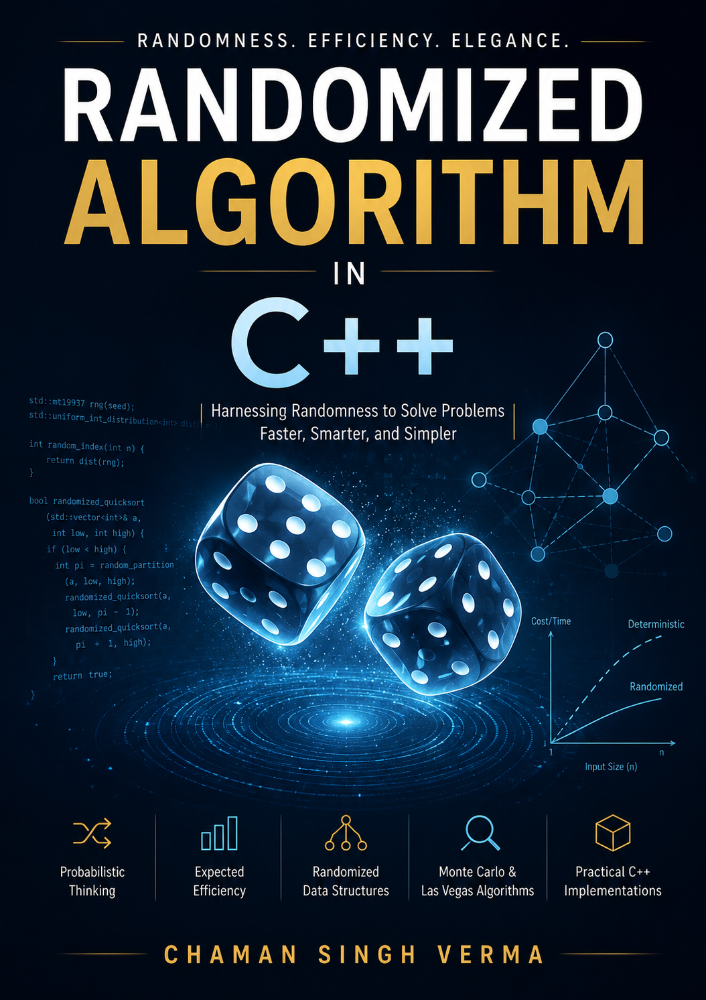

# Randomized Algorithms



C++ implementations of randomized algorithms and probabilistic techniques. Complete, compilable source code with empirical validation of theoretical results.

## Overview

This repository provides working implementations of randomized algorithms across key domains: graph algorithms, computational geometry, selection, and complexity theory. Each implementation accompanies theoretical analysis with practical demonstration.

## Chapter 1: Introduction

### Algorithms and Techniques

#### 1.1 Min-Cut Algorithm (Karger)
- **Implementation**: `src/chapter1/min_cut.h`
- **Method**: Randomized edge contraction
- **Analysis**: Success probability ≥ 2/n² per trial; failure probability decreases exponentially with repetition

#### 1.2 Las Vegas and Monte Carlo Paradigms
- **Implementation**: `src/chapter1/las_vegas_monte_carlo.h`
- **Las Vegas**: Randomized QuickSort — deterministic correctness, stochastic runtime
- **Monte Carlo**: Pi estimation (two-sided error), min-cut (one-sided error)
- **Conversion**: Monte Carlo to Las Vegas via verification

#### 1.3 Binary Planar Partitions
- **Implementation**: `src/chapter1/binary_planar_partition.h`
- **Application**: Hidden line elimination in computer graphics
- **Method**: RandAuto — randomized auto-partition algorithm
- **Complexity**: Expected size O(n log n) via linearity of expectation

#### 1.4 Probabilistic Recurrence
- **Implementation**: `src/chapter1/probabilistic_recurrence.h`
- **Algorithm**: Randomized selection (kth smallest element)
- **Complexity**: Expected O(n) time, O(log n) recursion depth
- **Distribution**: Geometric distribution analysis

#### 1.5 Computational Complexity Classes
- **Content**: Theoretical discussion (P, NP, RP, co-RP, ZPP, BPP, PP)
- **Hierarchy**: P ⊆ RP ⊆ NP ⊆ PSPACE ⊆ EXP ⊆ NEXP

### Utilities

- **Random Number Generation**: `src/chapter1/random_utils.h` — seeded PRNG for reproducible experiments

## Build Instructions

### Make
```bash
make chapter1      # Build
make run-chapter1  # Build and run
```

### CMake
```bash
mkdir build && cd build
cmake ..
make
./chapter1
```

### Direct Compilation
```bash
g++ -std=c++17 -O2 -o chapter1 src/chapter1/main.cpp -Isrc/chapter1
./chapter1
```

## Output

Each algorithm includes empirical validation comparing theoretical predictions with measured results:

| Section | Algorithm | Validation |
|---------|-----------|------------|
| 1.1 | Karger's Min-Cut | Single trial vs. n²/2 trials; failure probability analysis |
| 1.2 | QuickSort / Pi Estimation | Correctness guarantee; error convergence |
| 1.3 | RandAuto | 3-segment partition; sailor problem (indicator variables) |
| 1.4 | Randomized Selection | Recursive call count; geometric distribution fit |

## Key Concepts

1. **Randomization** — Simplifies algorithm design (min-cut vs. network flow)
2. **Error Reduction** — Independent repetition reduces failure probability exponentially
3. **Linearity of Expectation** — Applies without independence requirement
4. **Geometric Distribution** — Foundation of randomized algorithm analysis
5. **Probabilistic Method** — Constructive existence proofs

## License

See repository for license details.
